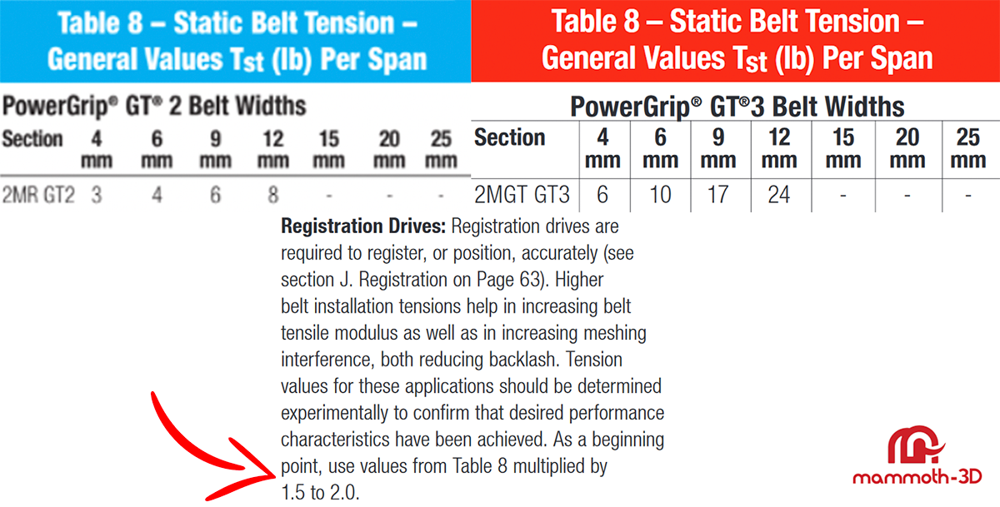

# **Belt Tension Calculator**

## ⚠️ **Important: Check Before Tensioning!**  

Before you start tensioning your belts, **ensure the tensioner is not pulling on the motor shaft!**  

### 🛠️ **Examples of setups where this applies:**
- All AWD upgrades for Voron printers with the default belt configuration  
- Monolight gantry  
- VZBot 235 and 330  

### 🚨 **Avoid Motor Shaft Damage!**  
Applying too much tension at once **can cause the motor shaft to bend or even result in permanent damage**.  

### 🚨 **Double Shear Bearing** 

If your gantry uses **double shear** bearings to support the motor shaft, you don’t need to worry about bending the shaft. However, if you're tensioning the belts via the motor shaft, be cautious not to **overstretch the belt**.

### ✅ **Recommended Tensioning Steps:**  
1. Start with an initial tension of **110-120 Hz**.  
2. **Increase in steps of 10–15 Hz at a time**.  
3. Move the gantry and belts to distribute tension.  
4. Repeat the process **only if needed** to reach the desired tension.    

Following this method ensures **a safer and more precise tensioning process**.  

## **Registration Drives**
Registration drives are crucial for accurate positioning, especially in applications like 3D printers. Higher belt tensions can improve belt tensile modulus and increase meshing interference, both of which help reduce backlash. The optimal tension values for these applications should be determined experimentally to ensure the desired performance characteristics are met.

As a starting point, a registration factor between **1.5** and **2.0** is recommended. However, it’s important to note that many 3D printers may not be able to handle a registration drive factor over **1.0**. You can find more infos in the **[Gates PDF](https://www.gates.com/content/dam/gates/home/knowledge-center/resource-library/catalogs/light-power-and-precision-manual.pdf)**.

### **For example:** 
**Voron [(Belt Tension)](https://docs.vorondesign.com/tuning/secondary_printer_tuning.html#belt-tension)** printers specify a registration factor of **0.5** on GT2 6mm belts (equivalent to **2lb** of tension) and **VZbot [(Belt Tension)](https://docs.vzbot.org/general/belt-tensioning/#vzbot-330)** printers specify a registration factor of **0.8375** up to **1.5** on GT2 6mm belts (equivalent to **3.35lb** up to **6lb** of tension)

## **Calculator**
Use this calculator to determine the optimal belt tension frequency, or refer to the table below for quick belt information.

<table class="calculator-table">
    <tr>
        <th>Select Belt Type:</th>
        <td>
            <select id="beltType">
                <option value="GT2">GT2</option>
                <option value="GT3">GT3</option>
            </select>
        </td>
    </tr>
    <tr>
        <th>Select Belt Width (mm):</th>
        <td>
            <select id="beltWidth">
                <option value="6">6 mm</option>
                <option value="9">9 mm</option>
                <option value="10">10 mm</option>
                <option value="12">12 mm</option>
            </select>
        </td>
    </tr>
    <tr>
        <th>Select Factor:</th>
        <td>
            <select id="factor">
                <option value="1">1</option>
                <option value="1.25">1.25</option>
                <option value="1.5">1.5</option>
                <option value="1.75" selected>1.75 (Default)</option>
                <option value="2">2</option>
            </select>
        </td>
    </tr>
    <tr>
        <th>Enter Belt Length (mm):</th>
        <td>
            <input type="number" id="beltLength" value="150">
        </td>
    </tr>
    <tr>
        <td colspan="2">
            <button id="calculate">Calculate</button>
        </td>
    </tr>
</table>

## **mammoth-3D Gantry Belt Tension** 

All mammoth-3D gantries are designed with the same principle: **Do not pull on the motor shaft when tensioning the belts**.  

Whether it's a Voron or VZBot gantry, they all function the same way. Over-tensioning can still damage short motor shafts, even if they are not directly used for belt tensioning.  

Refer to the table below for the recommended belt tension values for mammoth-3D gantries.

### **Belt Tension / Short Shaft Motor**  

| **mammoth-3D Gantry** | **GT2 Belts Minimum Tension** | **GT2 Belts Maximum Tension** | **GT3 Belts Minimum Tension** | **GT3 Belts Maximum Tension** |  
|:----------------------|:----------------------------:|:----------------------------:|:----------------------------:|:----------------------------:|  
| **3D Printed**        | 6mm Belts 147.40Hz / 4lbf    | 6mm Belts 180.53Hz / 6lbf    | ❌ Not Recommended           | ❌ Not Recommended           |  
| **Aluminum**          | 6mm Belts 147.40Hz / 4lbf    | 6mm Belts 180.53Hz / 6lbf    | ❌ Not Recommended           | ❌ Not Recommended           |  

### **Belt Tension / Long Shaft Motor (Double Shear)**  

| **mammoth-3D Gantry** | **GT2 Belts Minimum Tension** | **GT2 Belts Maximum Tension** | **GT3 Belts Minimum Tension** | **GT3 Belts Maximum Tension** |  
|:----------------------|:----------------------------:|:----------------------------:|:----------------------------:|:----------------------------:|  
| **3D Printed**        | 6mm Belts 180.53Hz / 6lbf     | 6mm Belts 194.99Hz / 7lbf   | ❌ Not Recommended           | ❌ Not Recommended           |  
| **Aluminum**          | 6mm Belts 180.53Hz / 6lbf     | 6mm Belts 194.99Hz / 7lbf   | 6mm Belts 258.45.53Hz / 15lbf| 6mm Belts 279.16Hz / 17.5lbf | 

