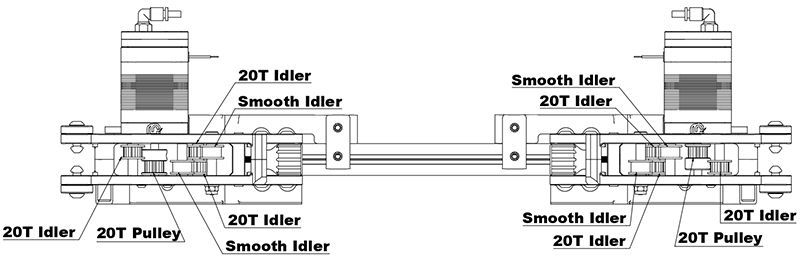
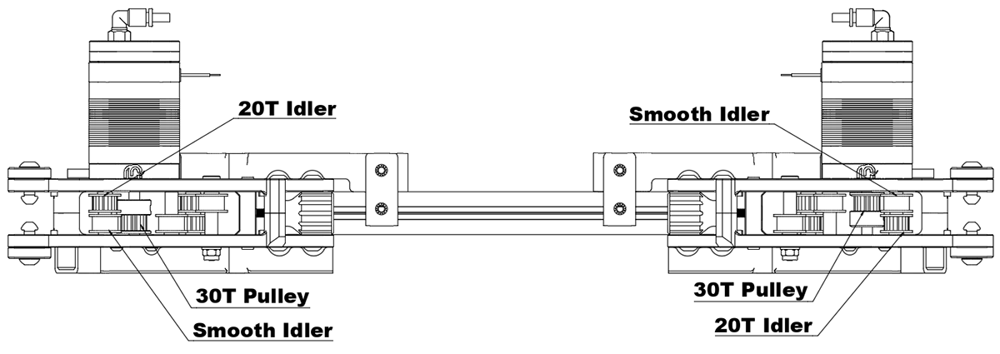
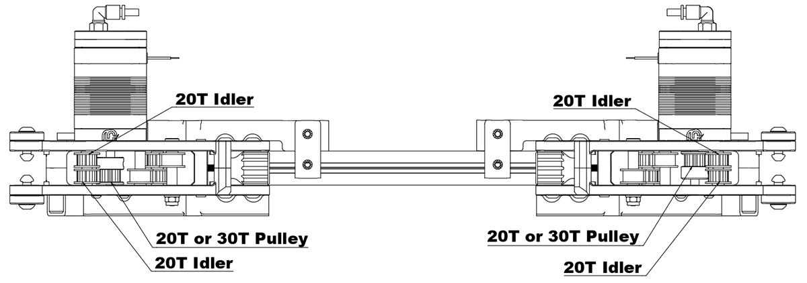

# **Idler Setup**

!!! note "Pulleys and Idlers"
    It is irrelevant whether you mount your motors on the mammoth-3D gantry at the top or bottom. The idlers and pulley positions will always remain the same, as seen in the images below.

    - VZ Toolhead / X-axis rail is top-mounted. For this setup, you will need VZ XY joiners.
    - Voron Toolhead / X-axis rail is front-mounted. For this setup, you will need mammoth-3D joiners.

                                                
| 20T Pulley / VZ Toolhead  |
|:-----------------------------------------------:|
||

| 30T Pulley / VZ Toolhead |
|:-----------------------------------------------:|
||
| All the other idlers remain the same as shown in the image: 20T Pulley / VZ Toolhead. |

| 20T or 30T Pulley / Voron Toolhead |
|:-----------------------------------------------:|
||
| All the other idlers remain the same as shown in the image: 20T Pulley / VZ Toolhead. |

