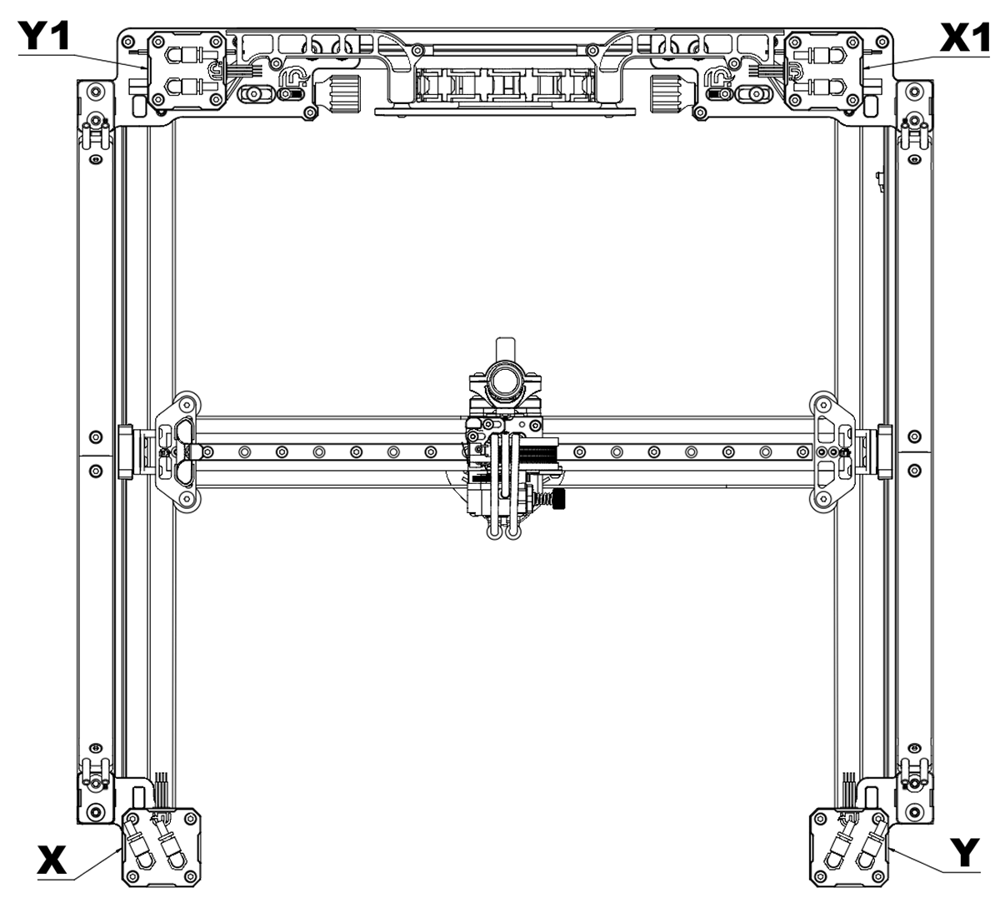

# **Motor Setup**

## **The motor setup remains the same across all gantries.**
Regardless of whether you are using it on a Voron 3D Printer, VZBOT, or RatRig vCore 3.1 or 4.

## **AWD Configuration:**
- The X motor is always in the front left.
- The Y motor is always in the front right.
- The X1 motor is always in the back right.
- The Y1 motor is always in the back left.

## **2WD Configuration:**
- The X1 (X) motor is always in the back right.
- The Y1 (Y) motor is always in the back left.

