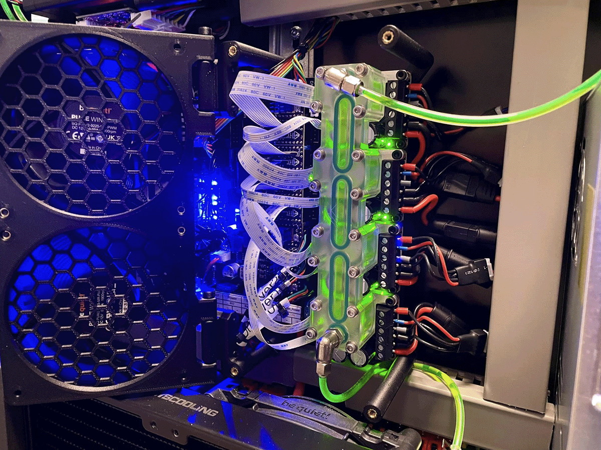
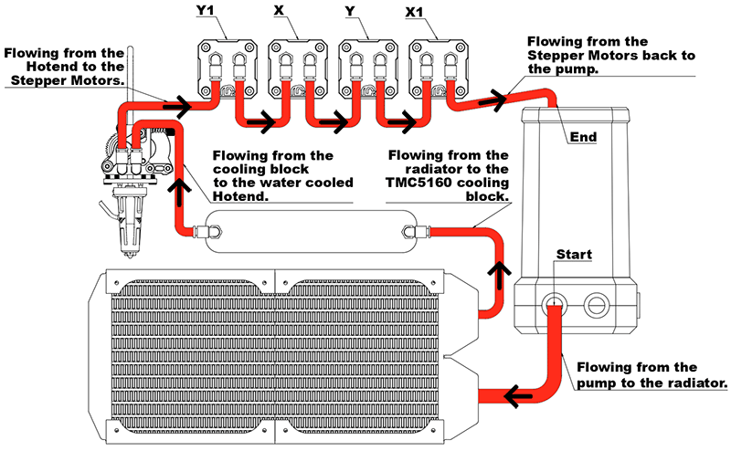

# **Water Cooling**

!!! tip
    **The water cooling inlet should always (or if possible) be the lowest point and the outlet should always be the highest point in your water cooling setup.**

!!! note "Pipe Length"
    The pipe length between the hotend and Y1 motor, as well as between the X and Y motors and the X1 motor and pump, is very long. It is recommended to use quick connectors for the day you need to remove the gantry without having to remove all the pipes as well.

