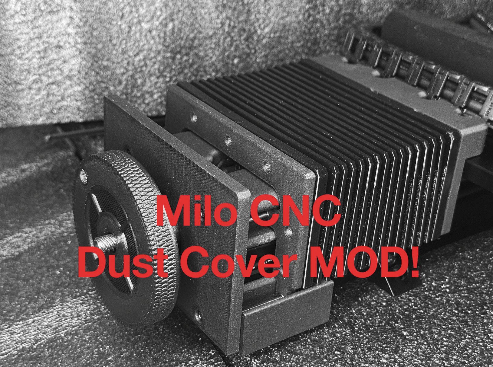

# **The Milo CNC Dust Cover by mammoth-3D** 

**Why This Mod Helps.**

- By shielding your rails and lead screw, this dust cover reduces contamination, lowers maintenance, and keeps your machine running smoother for longer. Perfect for woodworking, plastics, aluminum, and general CNC use.