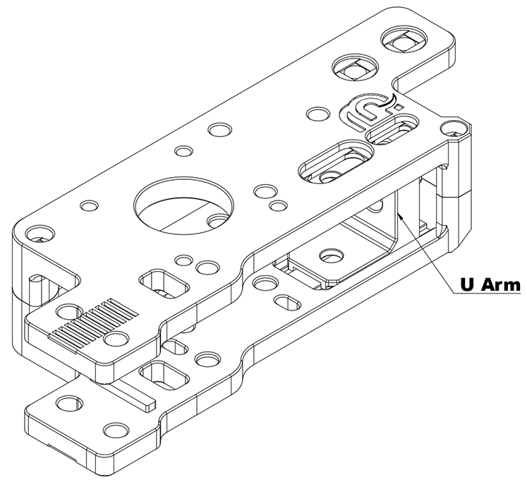
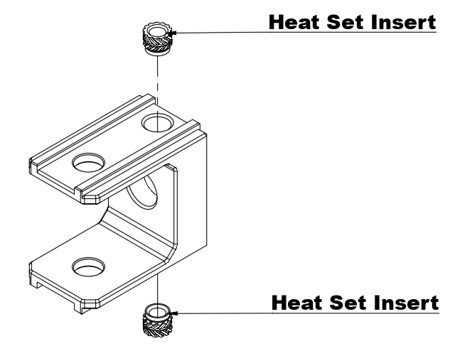
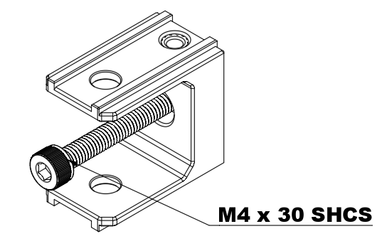
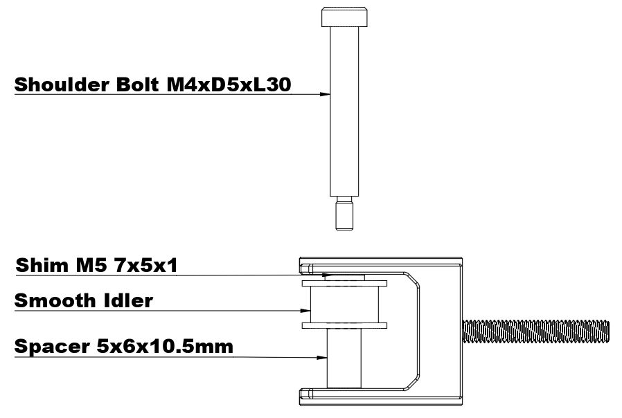

# **AWD Gantry with VZBOT Toolhead for Voron 2.4 3D Printers Preassembly Manual:**

## **Version 1.00 / 04. March 2025**

## **U Arm / Tensioner Arm**

- Check that the U Arm/Tensioner Arm moves freely from left to right. If you feel resistance, inspect the 3D-printed parts and remove any unwanted filament blobs. This step **is crucial** before assembling the gantry. Once you're satisfied with the movement, repeat the process for the second one.

- Install two heat set inserts and repeat the process for the second one.

- **Don`t over Tighten** The M4 bolt threads directly into plastic, repeat the process for the second one.

- In this step, the M4xD5xL30 Shoulder Bolt is used as an **assembly aid**. It helps align components and will be removed in a later step.
- Using the assembly aid, install one 7x5x1mm shim, a smooth idler and a 5x6x10.5mm spacer.
- Repeat the process for the second one.

!!! tip
    There is no top or bottom side in this step, so both tensioners should look the same.
    **Check that both smooth idlers move freely.**

!!! warning
    If the M4 Flat Head Screw is screwd in to deep, it will not fit if you assemble the Tensioner. We will screw it in all the way in a later stage.

!!! tip
    Repeat the same step for all 4x U prices.

---

Take 4x threaded inserts and install them into the Cover Body (short body).

!!! tip
    Repeat the same step for all 4x Cover Bodys.