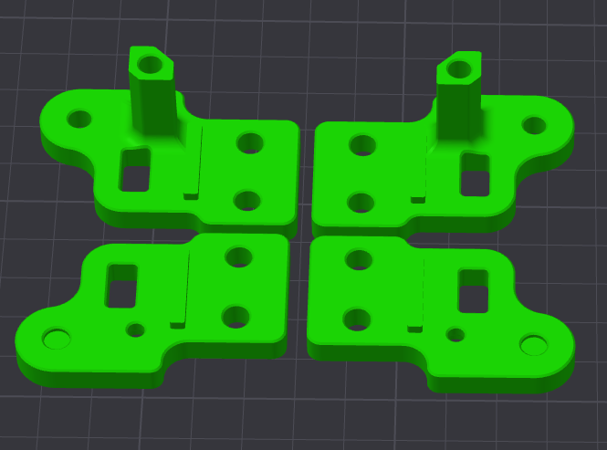
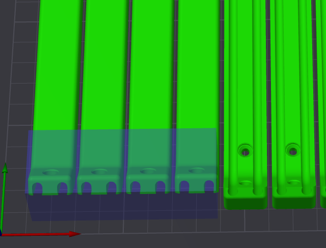

# **Printing Guide**

## **Version 1.00 / 04. March 2025**

## **Primary Color**

Example: `mammoth-3d X1 Top v173.step`
These files have no prefix in their filename so are safe to print in your primary color.

## **Accent Color**

Example: `[A] mammoth-3d U Arm x2.3mf`
These files are prefixed with `[A]` and are intended to be printed in your accent color.

## **Quantity Required**

Example: `[A] mammoth-3d Bearing Clamp x4.3mf`
If any file ends with `x#`, that is telling you the quantity of that part required to build the Gantry.

## **Required Size**

Example: `mammoth-3d Pipe Cable Holder Bottom Voron24_350.3mf`
If any file ends with `printername_#`, that is telling you to only print the size required for your printer size.

## **Support and Drilling Out Holes**

No need for that (99% whahahaha) :octicons-heart-fill-24:{ .heart } But maybe you need to cleanup your 3D printed parts.

!!! note "Layer Height and Line Width"
    Some parts have supporting layers to allow unsupported features to be printed successfully. These supports are designed to work at a layer height of **0.2mm**, so they may not be sliced correctly if your layer height is not **0.2mm**.

## **How to print AWD gantry parts**

## **Parts to print**
| **Qty** | **Name** | **Layer hight** | **Wall loops/Min. Wall Thickness** | **Top/Bottom shell layers** |**Infill** | **Material** | **Accent Color** |
|---------|----------|-----------------|------------------------------------|-----------------------------|----------------------|---|-|
| 1x | [X Motor Mount Top](https://www.printables.com/model/1096743-voron-24-mammoth-3d-awd-gantry-v173-x-and-y-motor/files#preview.file.4ENhI) | 0.2mm | **5**/2mm | 5 | 85% |ABS/ASA/PA-CF | :material-close: No |
| 1x | [X Motor Mount Bottom](https://www.printables.com/model/1096743-voron-24-mammoth-3d-awd-gantry-v173-x-and-y-motor/files#preview.file.sa1as) | 0.2mm | **5**/2mm | 5 | 85% | ABS/ASA/PA-CF | :material-close: No |
| 1x | [Y Motor Mount Top](https://www.printables.com/model/1096743-voron-24-mammoth-3d-awd-gantry-v173-x-and-y-motor/files#preview.file.oKF5u)  | 0.2mm | **5**/2mm | 5 | 85% | ABS/ASA/PA-CF | :material-close: No |
| 1x | [Y Motor Mount Bottom](https://www.printables.com/model/1096743-voron-24-mammoth-3d-awd-gantry-v173-x-and-y-motor/files#preview.file.r9EFS)  | 0.2mm | **5**/2mm | 5 | 85% | ABS/ASA/PA-CF | :material-close: No |
| 1x | [X1 Motor Mount Top](https://www.printables.com/model/1097920-voron-24-mammoth-3d-awd-gantry-v173-x1-and-y1-moto/files#preview.file.kTb59)  | 0.2mm | **5**/2mm   | 5 | 65% | ABS/ASA | :material-close: No |
| 1x | [X1 Motor Mount Bottom](https://www.printables.com/model/1097920-voron-24-mammoth-3d-awd-gantry-v173-x1-and-y1-moto/files#preview.file.XIOZ8)  | 0.2mm | **5**/2mm | 5 | 65% | ABS/ASA | :material-close: No |
| 1x | [Y1 Motor Mount Top](https://www.printables.com/model/1097920-voron-24-mammoth-3d-awd-gantry-v173-x1-and-y1-moto/files#preview.file.Zmang)  | 0.2mm | **5**/2mm | 5 | 65% | ABS/ASA | :material-close: No |
| 1x | [Y1 Motor Mount Bottom](https://www.printables.com/model/1097920-voron-24-mammoth-3d-awd-gantry-v173-x1-and-y1-moto/files#preview.file.c8LYf)  | 0.2mm | **5**/2mm | 5 | 65% | ABS/ASA | :material-close: No |
| 2x | [Tension Knob](https://www.printables.com/model/1097920-voron-24-mammoth-3d-awd-gantry-v173-x1-and-y1-moto/files#preview.file.mpfLr)  | 0.2mm | **4**/1.6mm | 5 | 42% | ABS/ASA | :material-check: Yes |
| 2x | [U ARM](https://www.printables.com/model/1097920-voron-24-mammoth-3d-awd-gantry-v173-x1-and-y1-moto/files#preview.file.PspAt)  | 0.2mm | **4**/1.6mm | 5 | 65% | ABS/ASA | :material-check: Yes |
| 4x | [Voron Belt Clamps](https://www.printables.com/model/1097920-voron-24-mammoth-3d-awd-gantry-v173-x1-and-y1-moto/files#preview.file.sa1JE)  | 0.2mm | **4**/1.6mm | 5 | 42% | ABS/ASA | :material-check: Yes |
| 4x | [Bearing Clamp](https://www.printables.com/model/1097920-voron-24-mammoth-3d-awd-gantry-v173-x1-and-y1-moto/files#preview.file.54Wdw)  | 0.2mm | **4**/1.6mm | 5 | 42% | ABS/ASA | :material-check: Yes |

!!! tip
    Not everyone uses long shaft motors, and there is no need to change your motors to use the gantry.
    If you are using standard motors in your build, you might consider using bearing covers to close the bearing hole.

## **Bearing Cover**
| **Qty** | **Name** | **Layer hight** | **Wall loops/Min. Wall Thickness** | **Top/Bottom shell layers** |**Infill** | **Material** | **Accent Color** |
|---------|----------|-----------------|------------------------------------|-----------------------------|----------------------|---|-|
| 2x | [Bearing Cover](https://www.printables.com/model/1097920-voron-24-mammoth-3d-awd-gantry-v173-x1-and-y1-moto/files#preview.file.2gA6J)  | 0.2mm | **4**/1.6mm | 5 | 42% | ABS/ASA | :material-check: Yes |
| 1x | [Bearing Clamp Logo Right](https://www.printables.com/model/1096743-voron-24-mammoth-3d-awd-gantry-v173-x-and-y-motor/files#preview.file.p1n1L)  | 0.2mm | **4**/1.6mm | 5 | 42% | ABS/ASA | :material-check: Yes |
| 1x | [Bearing Clamp Logo Left](https://www.printables.com/model/1096743-voron-24-mammoth-3d-awd-gantry-v173-x-and-y-motor/files#preview.file.XmyxO)  | 0.2mm | **4**/1.6mm | 5 | 42% | ABS/ASA | :material-check: Yes |

!!! tip
    Not everyone is interested in an AWD gantry system, so we also offer a 2WD option. The front idler mounts replace the need for the X/Y motor mounts.

### **How to print 2WD gantry parts**

## **2WD Parts to print**
| **Qty** | **Name** | **Layer hight** | **Wall loops/Min. Wall Thickness** | **Top/Bottom shell layers** |**Infill** | **Material** | **Accent Color** |
|---------|----------|-----------------|------------------------------------|-----------------------------|----------------------|---|-|
| 1x | [2WD X Top](https://www.printables.com/model/1113851-voron-24-mammoth-3d-2wd-gantry-v173-x-and-y-idler/files#preview.file.F3b8I)  | 0.2mm | **4**/1.6mm | 5 | 42% | ABS/ASA/PA-CF | :material-close: No |
| 1x | [2WD X Bottom](https://www.printables.com/model/1113851-voron-24-mammoth-3d-2wd-gantry-v173-x-and-y-idler/files#preview.file.DApj1)  | 0.2mm | **4**/1.6mm | 5 | 42% | ABS/ASA/PA-CF | :material-close: No |
| 1x | [2WD Y Top](https://www.printables.com/model/1113851-voron-24-mammoth-3d-2wd-gantry-v173-x-and-y-idler/files#preview.file.3Pxtp)  | 0.2mm | **4**/1.6mm | 5 | 42% | ABS/ASA/PA-CF | :material-close: No |
| 1x | [2WD Y Bottom](https://www.printables.com/model/1113851-voron-24-mammoth-3d-2wd-gantry-v173-x-and-y-idler/files#preview.file.CFBNe)  | 0.2mm | **4**/1.6mm | 5 | 42% | ABS/ASA/PA-CF | :material-close: No |

### **How to print motor cable routing and water cooling**

!!! tip
    Only add support on the one side of the 4x Pipe / Cable Holders

## **Cable routing and water cooling Parts to print**
| **Qty** | **Name** | **Layer hight** | **Wall loops/Min. Wall Thickness** | **Top/Bottom shell layers** |**Infill** | **Material** | **Accent Color** |
|---------|----------|-----------------|------------------------------------|-----------------------------|----------------------|---|-|
| 2x | [Nema17 Stand-off](https://www.printables.com/model/1100104-voron-24-mammoth-3d-awd-gantry-v173-cable-manageme/files#preview.file.8td4Q)  | 0.2mm | **4**/1.6mm | 5 | 42% | ABS/ASA/PA-CF | :material-check: Yes |
| 1x | [Motor Endstop Cover Right](https://www.printables.com/model/1100104-voron-24-mammoth-3d-awd-gantry-v173-cable-manageme/files#preview.file.ZoSv4)  | 0.2mm | **4**/1.6mm | 5 | 42% | ABS/ASA | :material-close: No |
| 1x | [Motor Endstop Cover Left](https://www.printables.com/model/1100104-voron-24-mammoth-3d-awd-gantry-v173-cable-manageme/files#preview.file.540T9)  | 0.2mm | **4**/1.6mm | 5 | 42% | ABS/ASA/PA-CF | :material-close: No |
| 1x | [Motor Cable Routing Right Voron24_300](https://www.printables.com/model/1100104-voron-24-mammoth-3d-awd-gantry-v173-cable-manageme/files#preview.file.LTn3H)  | 0.2mm | **4**/1.6mm | 5 | 42% | ABS/ASA | :material-check: Yes |
| 1x | [Motor Cable Routing Left Voron24_300](https://www.printables.com/model/1100104-voron-24-mammoth-3d-awd-gantry-v173-cable-manageme/files#preview.file.XmrST)  | 0.2mm | **4**/1.6mm | 5 | 42% | ABS/ASA | :material-check: Yes |
| 4x | [Y Axis Pipe Cable Holder Top Voron24_300](https://www.printables.com/model/1100104-voron-24-mammoth-3d-awd-gantry-v173-cable-manageme/files#preview.file.KdWTZ)  | 0.2mm | **4**/1.6mm | 5 | 42% | ABS/ASA/PA-CF | :material-close: No |
| 4x | [Y Axis Pipe Cable Holder Bottom Voron24_300](https://www.printables.com/model/1100104-voron-24-mammoth-3d-awd-gantry-v173-cable-manageme/files#preview.file.4Ezut)  | 0.2mm | **4**/1.6mm | 5 | 42% | ABS/ASA/PA-CF | :material-close: No |
| 1x | [Back Pipe Cable Managment Voron24_300](https://www.printables.com/model/1100104-voron-24-mammoth-3d-awd-gantry-v173-cable-manageme/files#preview.file.QOT1Q)  | 0.2mm | **4**/1.6mm | 5 | 42% | ABS/ASA/PA-CF | :material-close: No |
| 1x | [Motor Cable Routing Right Voron24_350](https://www.printables.com/model/1100104-voron-24-mammoth-3d-awd-gantry-v173-cable-manageme/files#preview.file.8tdOe)  | 0.2mm | **4**/1.6mm | 5 | 42% | ABS/ASA | :material-check: Yes |
| 1x | [Motor Cable Routing Left Voron24_350](https://www.printables.com/model/1100104-voron-24-mammoth-3d-awd-gantry-v173-cable-manageme/files#preview.file.SGjfc)  | 0.2mm | **4**/1.6mm | 5 | 42% | ABS/ASA | :material-check: Yes |
| 4x | [Y Axis Pipe Cable Holder Top Voron24_350](https://www.printables.com/model/1100104-voron-24-mammoth-3d-awd-gantry-v173-cable-manageme/files#preview.file.JBuYS)  | 0.2mm | **4**/1.6mm | 5 | 42% | ABS/ASA/PA-CF | :material-close: No |
| 4x | [Y Axis Pipe Cable Holder Bottom Voron24_350](https://www.printables.com/model/1100104-voron-24-mammoth-3d-awd-gantry-v173-cable-manageme/files#preview.file.N8KQB)  | 0.2mm | **4**/1.6mm | 5 | 42% | ABS/ASA/PA-CF | :material-close: No |
| 1x | [Back Pipe Cable Managment Voron24_350](https://www.printables.com/model/1100104-voron-24-mammoth-3d-awd-gantry-v173-cable-manageme/files#preview.file.oKGLD)  | 0.2mm | **4**/1.6mm | 5 | 42% | ABS/ASA/PA-CF | :material-close: No |

## **How to print KNOMI V2 Mount**

## **KNOMI V2 mount parts to print**
| **Qty** | **Name** | **Layer hight** | **Wall loops/Min. Wall Thickness** | **Top/Bottom shell layers** |**Infill** | **Material** | **Accent Color** |
|---------|----------|-----------------|------------------------------------|-----------------------------|----------------------|---|-|
| 1x | [Knomi v2 Front](https://www.printables.com/model/1124028-voron-24-mammoth-3d-awd-gantry-v173-knomi-v2-mount/files#preview.file.HItSj)  | 0.2mm | **4**/1.6mm | 5 | 42% | ABS/ASA | :material-close: No |
| 1x | [Knomi v2 Back](https://www.printables.com/model/1124028-voron-24-mammoth-3d-awd-gantry-v173-knomi-v2-mount/files#preview.file.vLfUb)  | 0.2mm | **4**/1.6mm | 5 | 42% | ABS/ASA/PA-CF | :material-close: No |