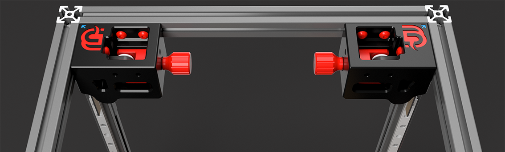

# **The Tool-free Z-Axis Belt Tensioner for Voron 2.4 3D Printers by Mammoth-3D is unique due to several key features:** 

**1. Tool-Free Adjustment:**

- The primary innovation of this tensioner is the ability to adjust the belt tension without the need for any tools. This convenience allows for quick and easy adjustments, saving time and simplifying the process for users.

**2. Dual Functionality:**

- It's not only a Z-Axis Belt Tensioner but also serves as a top brace, which improves input shaper results. This dual functionality enhances the overall stability and precision of the 3D printer, leading to better performance and print quality.

**3. Precision and Reliability:**

- It offers precise tension control, which is crucial for maintaining print quality and accuracy. Proper tension ensures that the printer operates smoothly and consistently, reducing the chances of print failures or inconsistencies.

**4. User-Friendly Design:**

- The design of the tensioner is ergonomic and user-friendly, making it accessible even for those who may not have extensive technical expertise. This helps in making the overall maintenance and adjustment process less intimidating.

**5. Compatibility with Voron 2.4:**

- Specifically designed for the Voron 2.4 3D printer, it fits seamlessly into the existing setup without requiring significant modifications. This ensures that users of Voron 2.4 can easily integrate the tensioner into their printers.

**6. Excellent Design:**

- Mammoth-3D products are known for their high-quality materials and robust construction. The belt tensioner features an excellent design that ensures durability and long-lasting performance, providing reliable operation over time.

**7. Enhanced Print Performance:**

- By maintaining optimal belt tension, the tool-free tensioner contributes to improved print quality. It helps in minimizing issues like layer shifting and print artifacts, leading to cleaner and more precise prints.

**8. Innovative Mechanism:**

- The mechanism employed for tension adjustment might involve innovative engineering solutions that make the adjustment process not only tool-free but also smooth and secure, preventing accidental loosening or overtightening.

These features collectively make the Tool-free Z-Axis Belt Tensioner by Mammoth-3D a valuable upgrade for Voron 2.4 3D printers, enhancing usability, performance, and reliability.