# **Tool-free Z-Axis Belt Tensioner for Voron 2.4 3D Printers Assembly Manual:**

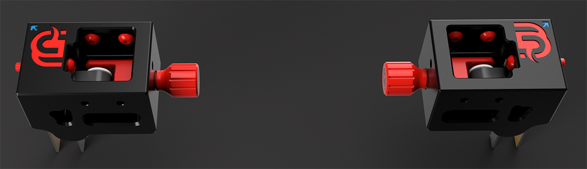

Take one of the Main Bodys and insert the U Pic assembly. The fat side fits into the Main Body.

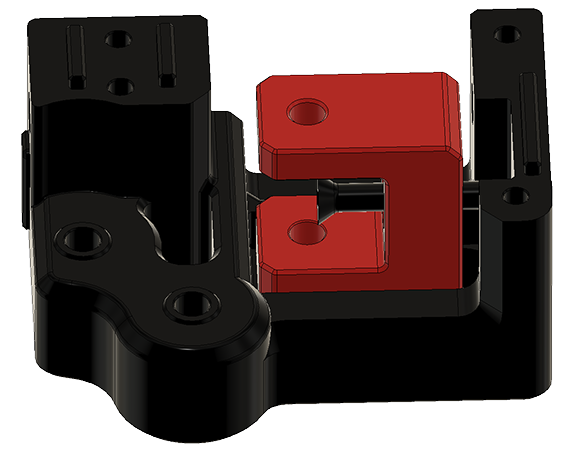

Now screw in the Flat Head Screw all the way and add 1x M4 washer 9x4x1mm and 1x M4 lock nut on the outside of the Main Body.

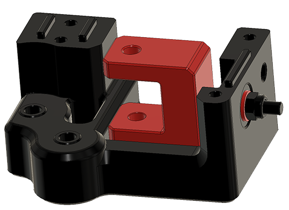

!!! tip
    Test if the Tensioner can move easy forwards and backwords. Now is the time to check and fix any problems. Later this step will not be so easy to fix or change.

---

Insert a M4 lock nut into the U Pic, take one 25mm sholder bolt and insert it into the U Pic. In the inside you should have a M5 5x7x1mm Shim - Mellow Pulleys 14/11 20 Tooth Wheel Bore 5mm GT2 - M5 5x7x1mm Shim. Screw the sholder bolt into the lock nut and check that the pulley can move freely.
!!! Warning
    Do not over tighten the sholder bolt! Or the Pully will not be able to turn freely.

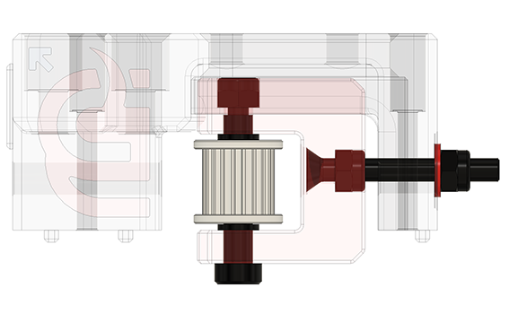 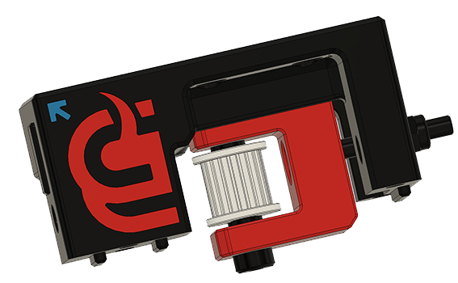

---

Insert 2x 30mm Sholder bolt into the Main Body.
!!! Warning
    Yes, it should be hard to push the sholder bolts into the 5mm hole! Don't make the holes bigger, as we dont want any play on the sholder bolts or pulleys.

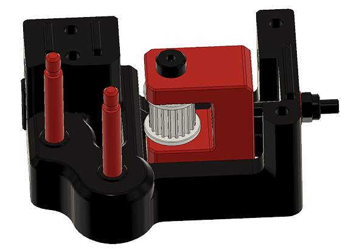

Install 2x M5 5x7x1mm shims, one on each sholder bolt.

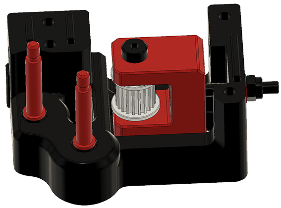

Install 1x Mellow Pulley 14/11 20 Tooth Wheel Bore 5mm GT2 on the outside and 1x Mellow Pulley 14/11 Smooth Wheel Bore 5mm GT2 in the inside.

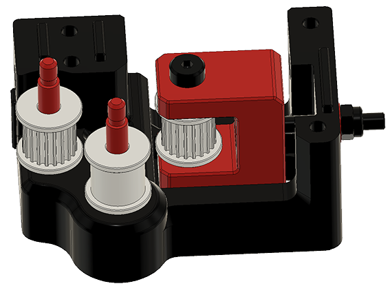

Install 2x M5 5x7x1mm shims, one on each sholder bolt.

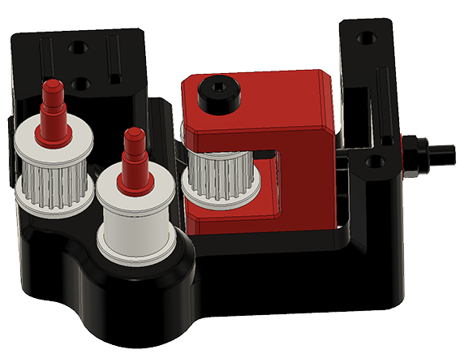

Take the matching Cover Body and screw the sholder bolts into the Cover Body till they start threading into the 3D printed part. Dont screw it in all the way!!

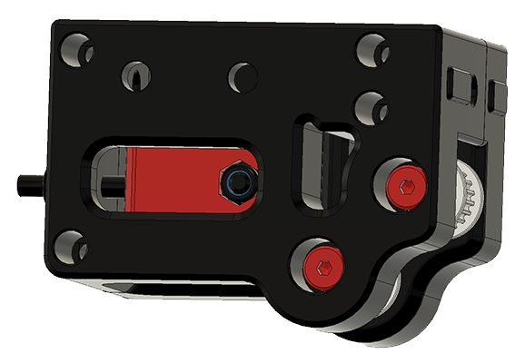

Take 4x M3 SHCS 25mm screws and install them into the Mail Body.

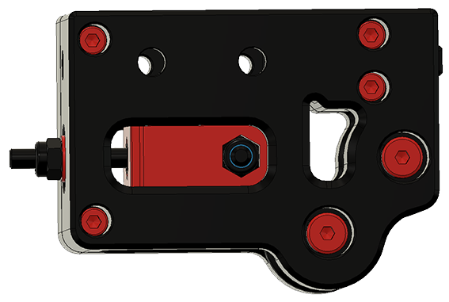

Now screw in the sholder bolts.

!!! Tip
    Don't over tighten them!! And check that the pulleys can move freely.

Repeat the same steps for all 4x Tensioner Bodys.

## **Get your Printer ready for the Z-Axis Belt Tensioner:**

- Move you gantry all the way down or secure it so that it will not drop when removing the Z belts!
- Once the gantry is secure, remove your stock Z Idlers and belts. You will need new belts, as the once installed are not long enough.

## **Install the Tool-free Z-Axis Belt Tensioner**

Install 3x Drop-in T-nut, M5 in each top corner. One in the Y-Axis and two in the front/back profile.
!!! Tip
    If you have Drop-in T-nut installed you can reuse them and just move and add one more per corner. If you are using M5 Hammer Head T-Nuts. Please change them for M5 T-nut.

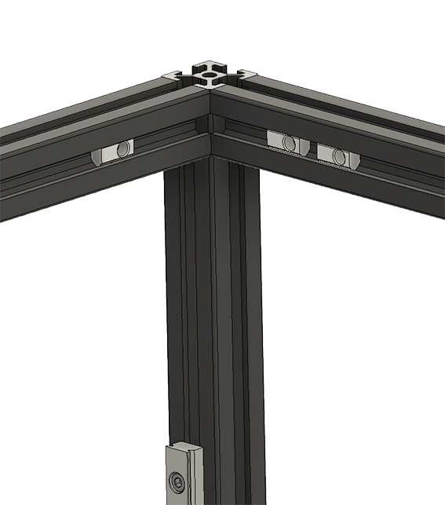

Check that you find the arrow on the tensioner body. In the image its in **blue**. The arrow has to be facing the corner when installing the belt tensiner.

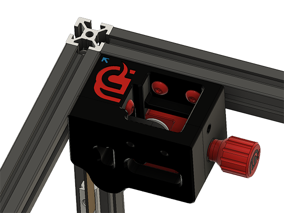

Take one of the M5x30 BHCS screws and secure it in the screw possition under the mammoth-3D Logo.

!!! Tip
    When installing the M5x30 BHCS screw, press the Tension Body as good as possible into the corner.

Take two of the M5x10 BHCS screw and install them into the provided holes.

Do the same steps for all 4 Tension Bodys.

---

Install your new 9mm GT2 belts. Make sure that the Belt Tensioner is loose and all the way in the Tension Body.

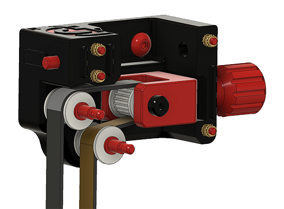

You can tension your belt by turning the tension-knob.

!!! Warning
    It is very easy to over tension your belts with the mammoth-3D belt tensioner. Remeber to test the tension of your belts as you turn the knob.