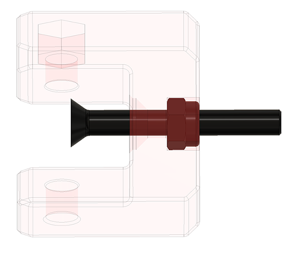
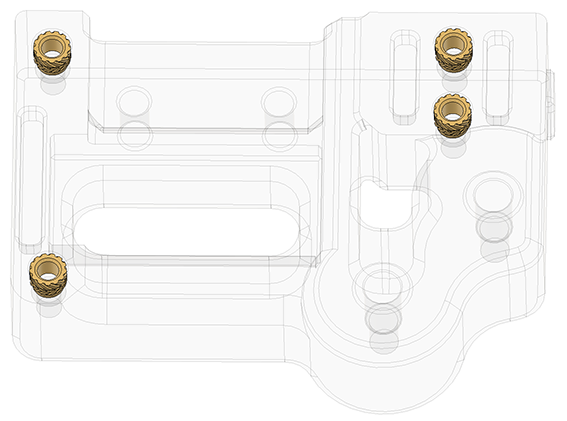

# **Z-Axis Belt Tensioner Preassembly Manual:**

Insert a M4 lock nut into the U Pic and screw in the M4 30mm Flat Head Screw 3/4 of the way.

!!! warning
    If the M4 Flat Head Screw is screwd in to deep, it will not fit if you assemble the Tensioner. We will screw it in all the way in a later stage.

!!! tip
    Repeat the same step for all 4x U prices.

---

Take 4x threaded inserts and install them into the Cover Body (short body).

!!! tip
    Repeat the same step for all 4x Cover Bodys.